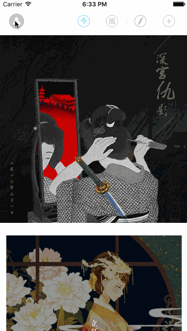
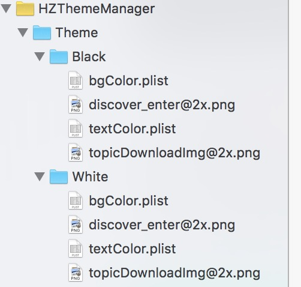

# HZThemeManager
多主题平滑切换的快速集成框架(Theme change)
#### 本项目交流群:32272635
#### 欢迎有兴趣的有好的想法的同学参与到项目中来，如果有问题请大家加入群中留言或者issue我，或者发邮件给我zuohong_xie@163.com

## Preview ##


## 添加 ##
```ruby
下载文件直接将HZThemeManager文件夹添加到项目中
```

## 其它资源 ##
* [简书论坛](http://www.jianshu.com/collection/ba017346481d)
* [HZExtend,快速开发项目的框架,结合了MVC和MVVM的优点](https://github.com/GeniusBrother/HZExtend)
* [HZMenuView,以UINavigationController为容器,且导航页面时不关闭的侧边栏](https://github.com/GeniusBrother/HZMenuView)
* [HZURLManager,使用URL进行导航跳转(support URL to navigate)](https://github.com/GeniusBrother/HZURLManager)

## 应用架构的基本思路 ##
```ruby
1.在资源包([NSBundle mainBundle])下建立多个独立的资源文件夹,存放对应的资源文件,必须要有bgColor.plist、textColor.plist这2个文件。
2.同一类型(指在同一个视图身上)不同样式的UI数据(UIColor,UIImage)用同一个标识符
3.ThemeManager会根据当前的主题去对应的文件夹下获取标识符所对应的数据
```


## 初始化配置 ##
```objective-c
- (BOOL)application:(UIApplication *)application didFinishLaunchingWithOptions:(NSDictionary *)launchOptions {

    /**
     *  主题文件夹路径配置
     */
    [ThemeManager sharedManager].themePaths = @{
                                                @"black":@"Theme/Black",
                                                @"white":@"Theme/White"
                                                };
                                                
    /**
     *  设置当前主题
     */
    [ThemeManager sharedManager].themeName = [[NSUserDefaults standardUserDefaults] objectForKey:@"theme"]?:@"white";
    return YES;
}
```

## 获取UI数据 ##
```objective-c
/**
 *  从ThemeManager获取UI数据
 */
self.view.backgroundColor = [[ThemeManager sharedManager] getThemeBgColorWithName:@"baseBgColor"];

/**
 *  获取当前主题下 imageName对应的图片
 *  imageName:图片类型标识
 */
- (UIImage *)getThemeImageWithName:(NSString *)imageName;

/**
 *  获取当前主题下 textColorName对应的颜色
 *  textColorName:文字颜色类型标识
 */
- (UIColor *)getThemeTextColorWithName:(NSString *)textColorName;
```

## 主题切换通知 ##
```objective-c
/**
 *  注册通知，主题改变时调用
 */
[[NSNotificationCenter defaultCenter] addObserver:self selector:@selector(themeChangeNotification:) name:kThemeDidChangeNotification object:nil];
```
## 利用UIFactory创建主题视图 ##
#### ThemeLabel
```objective-c
/**
 *  创建文本Label类型
 *  textColorName:颜色类型的标识符
 *  文本类型默认为NSString
 */
UILabel *themeLabel = [UIFactory themeLabelWithTextColorName:@"titleColor"];
themeLabel.text = @"开启夜间模式:";
themeLabel.font = [UIFont systemFontOfSize:16];
[self.view addSubview:themeLabel];
[themeLabel sizeToFit];
themeLabel.centerY = themeChange.centerY;
[themeLabel rightOverView:themeChange offset:-10];

```

#### ThemeImageView
```objective-c
/**
 *  创建图片ImageView类型
 *  imageName:图片类型的标识符
 */
UIImageView *themeImageView = [UIFactory themeImgViewWithImageName:@"discover_enter"];
themeImageView.frame = CGRectMake(0, 0, 60, 25);
themeImageView.center = CGPointMake(self.view.width/2, 250);
[self.view addSubview:themeImageView];

```
#### ThemeButton
```objective-c
/**
 *  创建按钮Button类型
 *  imageName:图片类型的标识符
 */
UIButton *themeBtn = [UIFactory themeButtonWithImageName:@"topicDownloadImg"];
themeBtn.frame = CGRectMake(0, 0, 42, 42);
themeBtn.center = CGPointMake(self.view.width/2, 200);
[self.view addSubview:themeBtn];
 
```
#### ThemeView
```objective-c
/**
 *  创建普通View类型
 *  bgColorName:颜色类型的标识符
 */
+ (ThemeView *)themeViewWithBgColorName:(NSString *)bgColorName;

```
